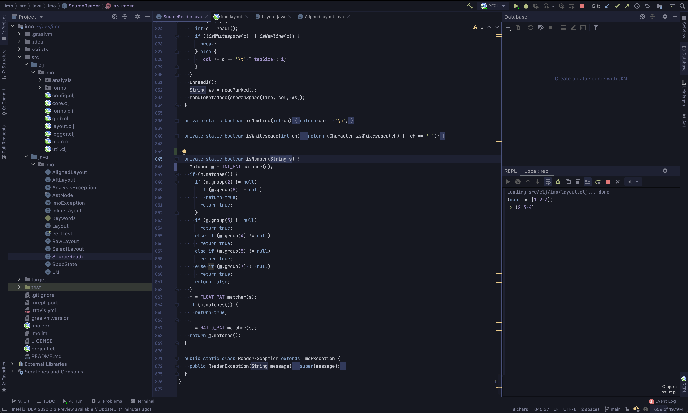
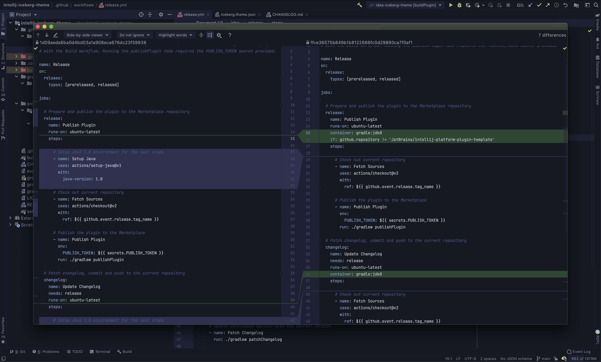

# Iceberg theme for IntelliJ

<!-- Plugin description -->
Dark blue color scheme for IntelliJ platform, based on [Iceberg](https://cocopon.github.io/iceberg.vim/) 
by [cocopon](https://github.com/cocopon).

<!-- Plugin description end -->

## Installation

- Using IDE built-in plugin system:
  
  <kbd>Preferences</kbd> > <kbd>Plugins</kbd> > <kbd>Marketplace</kbd> > <kbd>Search for "intellij-iceberg-theme"</kbd> >
  <kbd>Install Plugin</kbd>
  
- Manually:

  Download the [latest release](https://github.com/milankinen/intellij-iceberg-theme/releases/latest) and install it manually using
  <kbd>Preferences</kbd> > <kbd>Plugins</kbd> > <kbd>⚙️</kbd> > <kbd>Install plugin from disk...</kbd>

## License

Apache 2.0
